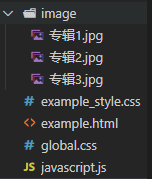

上周整理的知识，放在了ProcessOn里：https://www.processon.com/view/link/5fce131ce401fd19980ee711

周一的任务主要是写一个简单的demo，用到上周这本书中讲到的一些知识点

基础html文件是定义了一个nav导航栏和一个container中间栏，中间栏放置了轮播图（用JS实现）。



定义了一个global.css的全局文件，重置了html和body：

```CSS
html, body{
    margin: 0;
    padding: 0;
    height: 100%;
}
```

导航栏使用了《CSS世界》中所讲的z-index属性：

```css
.top-nav{
    z-index: 2;
    width: 100%;
    height: 50px;
    box-sizing: border-box;
    position: fixed;
    background-color: white;
    top: 0;
}
```

z-index属性：z-index 属性设置元素的堆叠顺序。拥有更高堆叠顺序的元素总是会处于堆叠顺序较低的元素的前面。

然后下面的轮播图效果用到了position定位，flex布局和float布局，将书中提到的布局用了一遍：

```css
#slider-banner{
    width: 400px;
    height: 400px;
    margin: 100px auto;
    background-color: black;
    position: relative;
    overflow: hidden;
}

#slider-imgList{
    list-style: none;
    padding: 0;
    margin: 0;
    height: 400px;
    position: absolute;
}

#slider-imgList li{
    float: left;
}

#slider-nav{
    width: 80px;
    display: flex;
    position: absolute;
    flex-direction: row;
    justify-content: space-between;
    bottom: 10px;
}
```

在做的时候，因为轮播图用到了ul，ul是块级元素，同样在html中默认样式的块级元素还有 div、h1-h、p、pre、ul、ol、li、form、table、label，注意在使用div作为父元素时，一定要将元素的margin，padding重置，不然会导致子元素不会被包裹进去。（千万千万要注意）

然后就是简单轮播图的JS代码：

```javascript
window.onload = function(){

    var sliderImgList = document.getElementById('slider-imgList');
    var sliderImgArr = sliderImgList.getElementsByTagName('li');
    sliderImgList.style.width = 400*sliderImgArr.length+"px";

    var sliderBanner =document.getElementById('slider-banner');
    var sliderNav = document.getElementById('slider-nav');
    sliderNav.style.left = (sliderBanner.offsetWidth - sliderNav.offsetWidth)/2+"px";

    var index = 0;
    var selectA = sliderNav.getElementsByTagName('a');
    selectA[index].style.backgroundColor = "darkcyan";

    autoChange();

    for(let i=0; i<selectA.length; i++){
        selectA[i].num = i;
        selectA[i].onclick = function(){
            clearInterval(timer);
            index = this.num;
            sliderImgList.style.left = -400*index + "px";
            setA();
            autoChange();
        }
    }

    function setA(){
        for(let i=0; i<selectA.length; i++){
            selectA[i].style.backgroundColor = "";
        }
        selectA[index].style.backgroundColor = "darkcyan";
    }

    var timer;
    function autoChange(){
        timer =setInterval(function(){
            index++;
            index %= sliderImgArr.length;
            sliderImgList.style.left = -400*index + "px";
            setA();
        },3000)
    }
}
```

弹出层学习：

对话框是用了JS实现的方法封装了一下，实现了类似完整的组件的方法：

JS代码：

```javascript
function showModal(data){
    //最外层内容div
    let content = document.createElement('div');
    content.setAttribute('class', 'modal-content');
    
    //关闭按钮
    let btn = document.createElement('button');
    btn.setAttribute('class', 'modal-close');
    btn.innerHTML = '×';
    
    //标题头
    let header = document.createElement('div');
    header.setAttribute('class', 'modal-header');
    let title = document.createElement('div');
    title.setAttribute('class', 'modal-title');
    title.innerHTML = '对话框';

    //涵盖提示文字div
    let modalbody = document.createElement('div');
    modalbody.setAttribute('class', 'modal-body');
    //提示的文字
    let p = document.createElement('p');
    textNode = document.createTextNode(data);

    //存放按钮底部
    let footer = document.createElement('div');
    footer.setAttribute('class', 'modal-footer');
    //确认按钮
    let btncfm = document.createElement('button');
    btncfm.setAttribute('class', 'btn-primary');
    btncfm.innerHTML = '确认';

    //遮罩层
    let wrap = document.createElement('div');
    wrap.setAttribute('class', 'modal-wrap');

    p.appendChild(textNode);
    footer.appendChild(btncfm);
    modalbody.appendChild(p);
    header.appendChild(title);
    content.appendChild(header);
    content.appendChild(btn);
    content.appendChild(modalbody);
    content.appendChild(footer);
    document.body.appendChild(wrap);
    document.body.appendChild(content);

    btn.onclick = function(){
    document.body.removeChild(content);
    document.body.removeChild(wrap);
    }

    btncfm.onclick = function(){
    document.body.removeChild(content);
    document.body.removeChild(wrap);
    }
}
```

CSS代码：

```css
.modal-content{
    position: fixed;
    top: 20%;
    left: 50%;
    width: 420px;
    height: 200px;
    z-index: 10;
    transition: all .3s;
    background: #fff;
    /* box-shadow: 0 0 10px #eee; */
    font-size: 10px;
    transform: translateX(-50%);
}


.modal-header{
    padding: 16px 24px;
    color: rgba(0,0,0,.85);
    font-size: 14px;
    background: #fff;
    border-bottom: 1px solid #f0f0f0;
    border-radius: 2px 2px 0 0;
}

.modal-close{
    width: 40px;
    height: 40px;
    font-size: 30px;
    position: absolute;
    top: 0;
    right: 0;
    z-index: 10;
    padding: 0;
    color: rgba(0,0,0,.45);
    font-weight: 700;
    line-height: 1;
    text-decoration: none;
    background: 0 0;
    border: 0;
    outline: 0;
    cursor: pointer;
}

.modal-body{
    padding: 24px;
    font-size: 14px;
    line-height: 1.5715;
}

.modal-footer{
    padding: 10px 16px;
    text-align: right;
    background: 0 0;
    border-top: 1px solid #f0f0f0;
    border-radius: 0 0 2px 2px;
}

.btn-primary{
    position: absolute;
    outline: 0;
    width: 56px;
    height: 32px;
    line-height: 1.5715;
    color: #fff;
    background: #1890ff;
    border-color: #1890ff;
    text-shadow: 0 -1px 0 rgba(0,0,0,.12);
    box-shadow: 0 0.5px 0 rgba(0,0,0,.015);
    border-radius: 5px;
    bottom: 20px;
    right: 20px;
}

.modal-wrap{
    position: fixed;
    top: 0;
    right: 0;
    bottom: 0;
    left: 0;
    z-index: 5;
    background-color: rgba(0, 0, 0, 0.4);
    transition: all .3s;
}
```

在使用时，只要将css和js引入，就可以在任意div或者元素上添加对话框。

消息提示框和对话框的区别在于，消息提示框是一个浮动的元素，没有遮盖层，不会对后续用户的交互有中断影响，提示消息后，用户仍可以做当前正在做的事情或者之后要做的事情。而对话框是一个有中断效果的交互框，z-index层下还有一层遮罩层，如果只看对话框的模块，z-index层分为三层，块级元素层-遮罩层-对话框层，遮罩层将html页面的其他元素遮盖，用户只能对对话框进行操作，将对话框关闭或者确认对话框后，才能消除中断，继续之后的网页交互。


